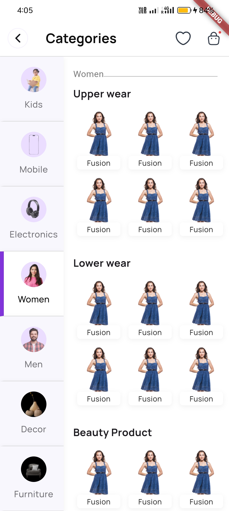

# Category Selector Flutter App

This Flutter app provides a categorized shopping experience, allowing users to explore different categories and subcategories with a clean and intuitive UI. Each category includes an icon and various subcategories, making it easy for users to navigate through different types of products.

## Features

- **Category Selection**: View and select from various categories like Kids, Mobile, Electronics, Women, Men, Decor, and Furniture.
- **Subcategory Navigation**: After selecting a category, users can explore detailed subcategories.
- **Responsive Design**: Optimized for mobile screens with smooth scrolling and beautiful icons.

## Screenshot



## Getting Started

To run this app locally:

1. **Clone the repository:**

   ```bash
   git clone https://github.com/jnvshubham7/Category-Selector.git
   cd Category-Selector
   ```
2. **Install dependencies:**
   Make sure you have Flutter installed, then run:

   ```bash
   flutter pub get
   ```
3. **Run the app:**
   Use the command below to start the app on an emulator or connected device:

   ```bash
   flutter run
   ```

## File Structure

- **`main.dart`**: Entry point of the app.
- **`CategorySelector`**: Core widget displaying categories with icons and subcategories.
- **`assets/`**: Folder containing icons and images used in the app.

## Dependencies

- **Flutter SDK**
- **Icons**: Ensure the assets (e.g., `assets/kids.png`, `assets/phone.png`) are present in the `assets/` folder and specified in the `pubspec.yaml`.

## License

This project is licensed under the MIT License.
